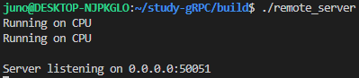

# gRPC를 활용한 Mat(OpenCV) 송수신 프로그램

### Clone and Build this Repository

```bash
cd ~
git clone --branch v2.2_Mat-Async https://github.com/YooJuno/study-gRPC.git
cd study-gRPC
mkdir build
cd build
cmake -DCMAKE_INSTALL_PREFIX=$HOME/.local  ../CMakeLists -B .
make -j 8
```

## **Try it!**

### SERVER

- ./remote_server

```bash
./remote_server
```
    

### CLIENT

- ./remote_client   <VIDEO_PATH>   <CIRCLE:0 , YOLO:1>
```bash
mkdir ../result
./remote_client ../dataset/video.mp4 1
```


- You can see the processed picture by server

    

    

### Reference

https://grpc.io/docs/languages/cpp/quickstart/

https://github.com/improvess/yOLOv4-opencv-cpp-python
