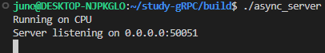
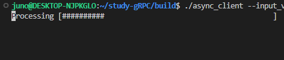
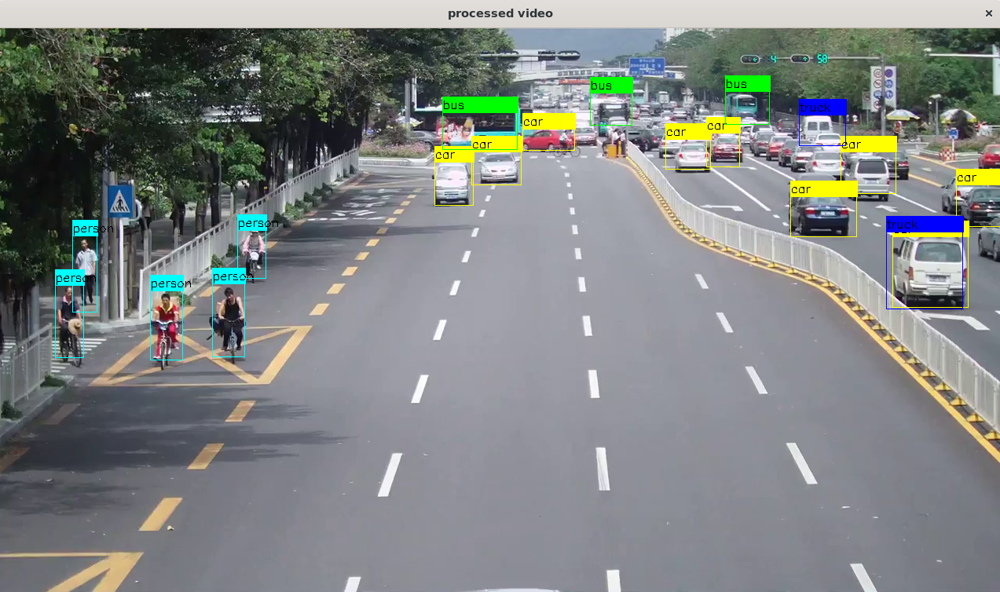

# gRPC를 활용한 비동기식 원격 YOLO 객체 인식 프로그램 - FINAL**

- **async_client.cc**
    1. 동영상을 불러와 이미지를 추출함과 동시에 서버로 한 장씩 비동기적으로 송신한다.
    2. 또한, 비동기적으로 서버로부터 객체의 정보(**YoloData**)를 수신하여 객체 리스트에 저장한다.
    3. 모든 영상처리에 대한 수신이 끝나면 원본 동영상에 **YoloData**를 합쳐 재생 및 저장을 진행한다.
- **async_server.cc**
    1. 클라이언트로부터 수신한 이미지에서 YOLO를 사용하여 객체를 검출해낸다.
    2. 검출된 객체의 정보인 **YoloData**를 회신한다.
    3. 이미지의 수신, 처리, 회신의 과정은 비동기적으로 진행되어 이미지가 들어오는 즉시 처리가 시작되고 완료되면 회신한다.
    4. 비동기 구현은 **Completeion Queue**를 사용하여 CREATE -> PROCESS -> FINISH 순으로 요청을 처리한다.

## **Clone & Build this Repository**

```
cd ~
git clone --branch v3.0_gRPC-Final https://github.com/YooJuno/study-gRPC.git
cd study-gRPC
mkdir build
cd build
cmake -DCMAKE_INSTALL_PREFIX=$HOME/.local  ../CMakeLists.txt -B .
make -j 8
```

# **How it works**
```
1. Client sends images continueously extracted from video.
2. Server receives image and process YOLO with.
3. Server doesn't return processed image, but metadata of detected objects information such as x,y width, height...
4. With recieved metadata of YOLO from server, client merge it to original image and create new video which contains YOLO bounding boxes in every images.
```

# **Try it!**

## **SERVER**

```bash
./remote_server
```



## **CLIENT**

### **./remote_client    --input_video_path=<…>     --output_video_path=<…>**

```
./async_client
```

- You don’t need to put arguments. It has a default values for args.

## Result

!https://github.com/YooJuno/study-gRPC/raw/v3.0_gRPC-Final/images/image-1.png




- Press ESC key if you wanna quit player.


**Reference**

https://grpc.io/docs/languages/cpp/quickstart/

https://github.com/improvess/yOLOv4-opencv-cpp-python
