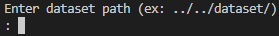

# gRPC를 활용한 Stream 방식의 대용량 파일 다운로드 프로그램**

- **remote_client.cc**
    1. 서버로부터 받은 파일 목록 중, 원하는 파일을 요청하여 chunk 단위로 나눠서 수신.
- **remote_server.cc**
    1. 클라이언트에게 파일 목록을 제공하고, 요청받은 파일에 대해 chunk 단위로 나눠 전송.

### Clone and Build this Repository

## **Try it!**

### SERVER

```bash
./remote_serv
```

- and then enter dataset path




### CLIENT

```bash
./remote_client
```

- Enter ID, Password
    
    
    

- Choose number you wanna download.
    
    
    

- Then you can see the information of file you select.
    
    
    

- Last, Enter the path of Download Folder
    
    
    

- You can see the picture in Download folder
    
    
    
    
    

### Reference

https://grpc.io/docs/languages/cpp/quickstart/
