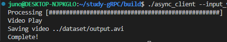

# gRPC를 활용한 원격 영상 처리 프로그램

## **Clone & Build this Repository**

```
cd ~
git clone --branch v3.0_gRPC-Final https://github.com/YooJuno/study-gRPC.git
cd study-gRPC
mkdir build
cd build
cmake -DCMAKE_INSTALL_PREFIX=$HOME/.local  ../CMakeLists -B .
make -j 8
```

# **Try it!**

## **SERVER**

```bash
./remote_server
```

!https://github.com/YooJuno/study-gRPC/raw/v3.0_gRPC-Final/images/image.png

## **CLIENT**

### **./remote_client    --input_video_path=<…>     --output_video_path=<…>**

```
./async_client
```

- You don’t need to put arguments. It has a default values for args.

## Result

!https://github.com/YooJuno/study-gRPC/raw/v3.0_gRPC-Final/images/image-1.png


- Press ESC key if you wanna quit player.




**Reference**

https://grpc.io/docs/languages/cpp/quickstart/

https://github.com/improvess/yOLOv4-opencv-cpp-python